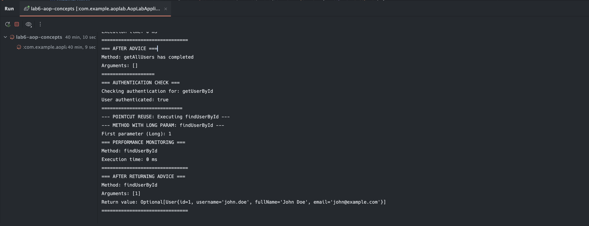
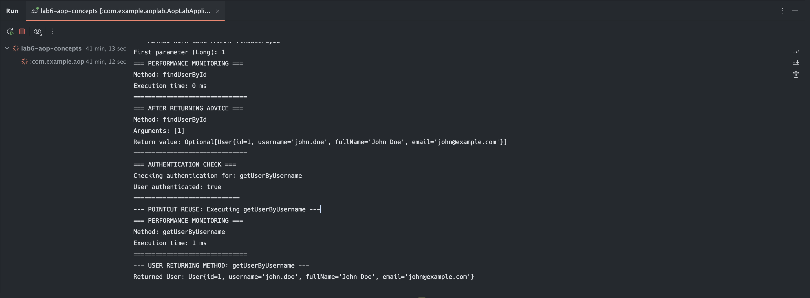
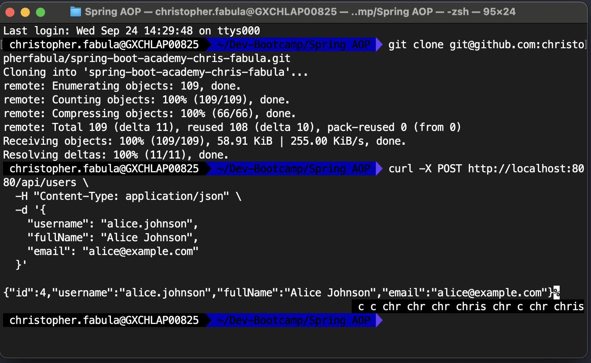
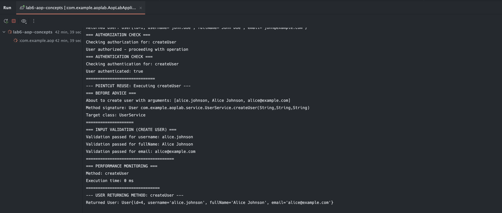
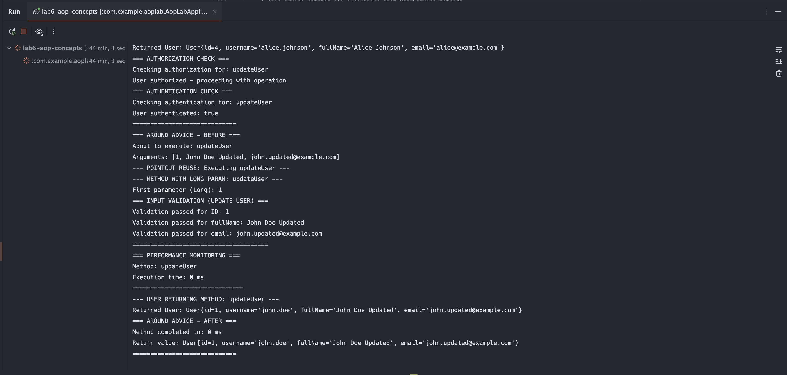
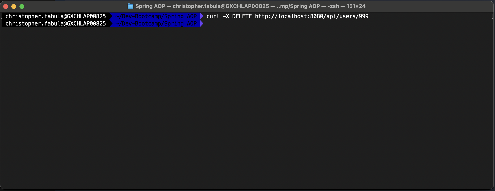
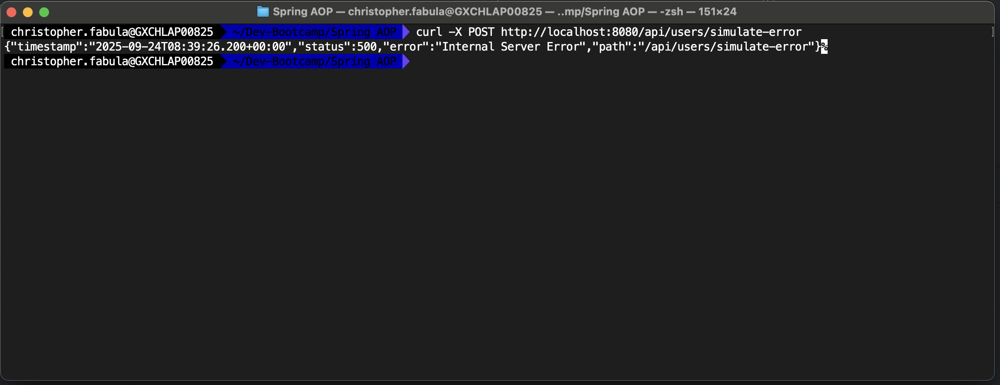

# Lab 6: Spring AOP Key Concepts

## Difficulty Level
**Intermediate**

## Learning Objectives
- Understand the five key AOP concepts: Aspect, Advice, Join Point, Pointcut, and Weaving
- Implement different types of advice: @Before, @After, @AfterReturning, @AfterThrowing, @Around
- Learn to create and use pointcut expressions
- Understand how AOP enables cross-cutting concerns
- Implement practical examples of logging, performance monitoring, security, and validation aspects
- Learn best practices for organizing and structuring aspects

## Scenario
You're building a user management system where you need to implement cross-cutting concerns like logging, performance monitoring, security checks, and input validation. Instead of scattering this code throughout your business logic, you'll use Spring AOP to implement these concerns as aspects that can be applied across multiple methods and classes.

## AOP Key Concepts Overview

### 1. Aspect
An aspect is a modularization of a cross-cutting concern. In our lab, aspects like `LoggingAspect`, `PerformanceAspect`, and `SecurityAspect` encapsulate specific cross-cutting functionality.

### 2. Advice
Advice is the action taken by an aspect at a particular join point. Types of advice:
- **@Before**: Executes before the join point
- **@After**: Executes after the join point (regardless of success/failure)
- **@AfterReturning**: Executes after successful completion of the join point
- **@AfterThrowing**: Executes when the join point throws an exception
- **@Around**: Executes before and after the join point (can control execution)

### 3. Join Point
A join point is a point during the execution of a program where an aspect can be applied. In Spring AOP, these are method execution points.

### 4. Pointcut
A pointcut is a predicate that matches join points. Pointcut expressions define where advice should be applied.

### 5. Weaving
Weaving is the process of applying aspects to target objects. Spring AOP performs weaving at runtime using proxies.

## Initial Project Setup

### Dependencies Required
The project is already configured with the necessary dependencies in `build.gradle`:

```gradle
dependencies {
    implementation 'org.springframework.boot:spring-boot-starter-web'
    implementation 'org.springframework.boot:spring-boot-starter-aop'
    implementation 'org.springframework.boot:spring-boot-starter-actuator'
    implementation 'org.springframework.boot:spring-boot-starter-validation'
    testImplementation 'org.springframework.boot:spring-boot-starter-test'
}
```

## Step-by-step Instructions

### 1. Enable AOP in the Application

First, you need to enable AspectJ auto-proxying in your Spring Boot application.

**File:** `src/main/java/com/example/aoplab/AopLabApplication.java`

```java
@SpringBootApplication
@EnableAspectJAutoProxy // TODO 1: Uncomment this line to enable AspectJ auto-proxying
public class AopLabApplication {
    // ... rest of the class
}
```

**TODO 1:** Uncomment the `@EnableAspectJAutoProxy` annotation to enable AOP functionality.

### 2. Understanding the Service Layer

The lab includes a `UserService` class with various methods that will be advised by our aspects:

- `createUser()` - Creates a new user
- `findUserById()` - Finds a user by ID
- `updateUser()` - Updates user information
- `deleteUser()` - Deletes a user
- `getAllUsers()` - Retrieves all users
- `getUserByUsername()` - Finds user by username
- `simulateError()` - Simulates an exception for testing

### 3. Progressive AOP Implementation

Follow the TODOs in order to progressively enable different AOP features:

#### TODO 2: @Before Advice
**File:** `src/main/java/com/example/aoplab/aspect/LoggingAspect.java`

Uncomment the `@Before` annotation for the `logBeforeCreateUser` method:

```java
@Before("execution(* com.example.aoplab.service.UserService.createUser(..))")
public void logBeforeCreateUser(JoinPoint joinPoint) {
    // ... method implementation
}
```

**What this does:** Logs information before the `createUser` method executes.

#### TODO 3: @AfterReturning Advice
Uncomment the `@AfterReturning` annotation for the `logAfterReturningFindUser` method:

```java
@AfterReturning(pointcut = "execution(* com.example.aoplab.service.UserService.findUserById(..))", returning = "result")
public void logAfterReturningFindUser(JoinPoint joinPoint, Object result) {
    // ... method implementation
}
```

**What this does:** Logs information after the `findUserById` method successfully returns.

#### TODO 4: @Around Advice
Uncomment the `@Around` annotation for the `logAroundUpdateUser` method:

```java
@Around("execution(* com.example.aoplab.service.UserService.updateUser(..))")
public Object logAroundUpdateUser(ProceedingJoinPoint joinPoint) throws Throwable {
    // ... method implementation
}
```

**What this does:** Logs information before and after the `updateUser` method executes, including execution time.

#### TODO 5: @AfterThrowing Advice
Uncomment the `@AfterThrowing` annotation for the `logAfterThrowingDeleteUser` method:

```java
@AfterThrowing(pointcut = "execution(* com.example.aoplab.service.UserService.deleteUser(..))", throwing = "exception")
public void logAfterThrowingDeleteUser(JoinPoint joinPoint, Exception exception) {
    // ... method implementation
}
```

**What this does:** Logs information when the `deleteUser` method throws an exception.

#### TODO 6: @After Advice
Uncomment the `@After` annotation for the `logAfterGetAllUsers` method:

```java
@After("execution(* com.example.aoplab.service.UserService.getAllUsers(..))")
public void logAfterGetAllUsers(JoinPoint joinPoint) {
    // ... method implementation
}
```

**What this does:** Logs information after the `getAllUsers` method completes, regardless of success or failure.

#### TODO 7: Pointcut Reuse
Uncomment the `@Before` annotation for the `logAllUserServiceMethods` method:

```java
@Before("userServiceMethods()")
public void logAllUserServiceMethods(JoinPoint joinPoint) {
    // ... method implementation
}
```

**What this does:** Demonstrates how to reuse pointcut definitions across multiple advice methods.

#### TODO 8: Parameter-based Pointcuts
Uncomment the `@Before` annotation for the `logMethodsWithLongParam` method:

```java
@Before("userServiceMethodsWithLongParam()")
public void logMethodsWithLongParam(JoinPoint joinPoint) {
    // ... method implementation
}
```

**What this does:** Shows how to create pointcuts that match methods with specific parameter types.

#### TODO 9: Return Type-based Pointcuts
Uncomment the `@AfterReturning` annotation for the `logUserReturningMethods` method:

```java
@AfterReturning(pointcut = "userServiceMethodsReturningUser()", returning = "result")
public void logUserReturningMethods(JoinPoint joinPoint, Object result) {
    // ... method implementation
}
```

**What this does:** Demonstrates how to create pointcuts that match methods returning specific types.

#### TODO 10: Global Exception Handling
Uncomment the `@AfterThrowing` annotation for the `logAllExceptions` method:

```java
@AfterThrowing(pointcut = "userServiceMethods()", throwing = "exception")
public void logAllExceptions(JoinPoint joinPoint, Exception exception) {
    // ... method implementation
}
```

**What this does:** Shows how to implement global exception logging across all service methods.

#### TODO 11: Performance Monitoring
**File:** `src/main/java/com/example/aoplab/aspect/PerformanceAspect.java`

Uncomment the `@Around` annotation for the `measurePerformance` method:

```java
@Around("serviceLayerMethods()")
public Object measurePerformance(ProceedingJoinPoint joinPoint) throws Throwable {
    // ... method implementation
}
```

**What this does:** Measures and logs the execution time of all service layer methods.

#### TODO 12: Authentication Aspect
**File:** `src/main/java/com/example/aoplab/aspect/SecurityAspect.java`

Uncomment the `@Before` annotation for the `checkAuthentication` method:

```java
@Before("controllerMethods()")
public void checkAuthentication(JoinPoint joinPoint) {
    // ... method implementation
}
```

**What this does:** Simulates authentication checks before all controller method executions.

#### TODO 13: Authorization Aspect
Uncomment the `@Around` annotation for the `checkAuthorization` method:

```java
@Around("modificationMethods()")
public Object checkAuthorization(ProceedingJoinPoint joinPoint) throws Throwable {
    // ... method implementation
}
```

**What this does:** Simulates authorization checks for data modification operations.

#### TODO 14: Input Validation for Create Operations
**File:** `src/main/java/com/example/aoplab/aspect/ValidationAspect.java`

Uncomment the `@Before` annotation for the `validateCreateUserInput` method:

```java
@Before("createUserMethods()")
public void validateCreateUserInput(JoinPoint joinPoint) {
    // ... method implementation
}
```

**What this does:** Validates input parameters before creating a new user.

#### TODO 15: Input Validation for Update Operations
Uncomment the `@Before` annotation for the `validateUpdateUserInput` method:

```java
@Before("updateUserMethods()")
public void validateUpdateUserInput(JoinPoint joinPoint) {
    // ... method implementation
}
```

**What this does:** Validates input parameters before updating an existing user.

## Running and Testing the Application

### 1. Start the Application
```bash
./gradlew bootRun
```

### 2. Test the AOP Functionality

#### Test Basic User Operations
```bash
# Get all users (will trigger @After advice)
curl http://localhost:8080/api/users

# Get user by ID (will trigger @AfterReturning advice)
curl http://localhost:8080/api/users/1

# Get user by username (will trigger parameter-based advice)
curl http://localhost:8080/api/users/username/john.doe

# Create a new user (will trigger @Before advice and validation)
curl -X POST http://localhost:8080/api/users \
  -H "Content-Type: application/json" \
  -d '{
    "username": "alice.johnson",
    "fullName": "Alice Johnson",
    "email": "alice@example.com"
  }'

# Update a user (will trigger @Around advice)
curl -X PUT http://localhost:8080/api/users/1 \
  -H "Content-Type: application/json" \
  -d '{
    "fullName": "John Doe Updated",
    "email": "john.updated@example.com"
  }'

# Delete a user (will trigger @AfterThrowing if user doesn't exist)
curl -X DELETE http://localhost:8080/api/users/999

# Simulate an error (will trigger @AfterThrowing advice)
curl -X POST http://localhost:8080/api/users/simulate-error
```

### 3. Observe AOP Behavior

As you enable each TODO, you'll see different types of output in the console:

#### Before Advice Output
```
=== BEFORE ADVICE ===
About to create user with arguments: [alice.johnson, Alice Johnson, alice@example.com]
Method signature: User com.example.aoplab.service.UserService.createUser(String,String,String)
Target class: UserService
====================
```

#### After Returning Advice Output
```
=== AFTER RETURNING ADVICE ===
Method: findUserById
Arguments: [1]
Return value: User{id=1, username='john.doe', fullName='John Doe', email='john@example.com'}
===============================
```

#### Around Advice Output
```
=== AROUND ADVICE - BEFORE ===
About to execute: updateUser
Arguments: [1, John Doe Updated, john.updated@example.com]
=== AROUND ADVICE - AFTER ===
Method completed in: 15 ms
Return value: User{id=1, username='john.doe', fullName='John Doe Updated', email='john.updated@example.com'}
=============================
```

#### Performance Monitoring Output
```
=== PERFORMANCE MONITORING ===
Method: createUser
Execution time: 8 ms
===============================
```

## Verification Steps

### 1. AOP Concepts Verification
- ✅ **Aspect**: Verify that cross-cutting concerns are properly modularized in separate aspect classes
- ✅ **Advice**: Confirm that different types of advice (@Before, @After, etc.) execute at the correct times
- ✅ **Join Point**: Observe that advice is applied at method execution points
- ✅ **Pointcut**: Verify that pointcut expressions correctly match target methods
- ✅ **Weaving**: Confirm that aspects are properly woven into the target objects

### 2. Advice Type Verification
- ✅ **@Before**: Logs appear before method execution
- ✅ **@After**: Logs appear after method completion (success or failure)
- ✅ **@AfterReturning**: Logs appear only after successful method completion
- ✅ **@AfterThrowing**: Logs appear when methods throw exceptions
- ✅ **@Around**: Logs appear both before and after method execution

### 3. Pointcut Expression Verification
- ✅ **Execution pointcuts**: Match specific method executions
- ✅ **Reusable pointcuts**: @Pointcut methods can be referenced by multiple advice
- ✅ **Parameter-based pointcuts**: Match methods with specific parameter types
- ✅ **Return type-based pointcuts**: Match methods returning specific types

## Expected Output Examples

### Console Output for User Creation
```
--- POINTCUT REUSE: Executing createUser ---
=== INPUT VALIDATION (CREATE USER) ===
Validation passed for username: alice.johnson
Validation passed for fullName: Alice Johnson
Validation passed for email: alice@example.com
=====================================
=== AUTHENTICATION CHECK ===
Checking authentication for: createUser
User authenticated: true
=============================
=== AUTHORIZATION CHECK ===
Checking authorization for: createUser
User authorized - proceeding with operation
=== BEFORE ADVICE ===
About to create user with arguments: [alice.johnson, Alice Johnson, alice@example.com]
Method signature: User com.example.aoplab.service.UserService.createUser(String,String,String)
Target class: UserService
====================
=== PERFORMANCE MONITORING ===
Method: createUser
Execution time: 12 ms
===============================
--- USER RETURNING METHOD: createUser ---
Returned User: User{id=4, username='alice.johnson', fullName='Alice Johnson', email='alice@example.com'}
```

### JSON Response for User Creation
```json
{
  "id": 4,
  "username": "alice.johnson",
  "fullName": "Alice Johnson",
  "email": "alice@example.com"
}
```

## Reflection Questions

1. **What are the advantages of using AOP for cross-cutting concerns?**
   - Separation of concerns: Business logic stays focused on business functionality
   - Code reusability: Aspects can be applied to multiple methods/classes
   - Maintainability: Changes to cross-cutting concerns only need to be made in one place
   - Cleaner code: Business logic is not cluttered with infrastructure concerns

2. **When would you choose @Around advice over other advice types?**
   - When you need to control whether the target method executes
   - When you need to execute code both before and after the target method
   - When you need to measure execution time or performance
   - When you need to implement retry logic or caching

3. **How do pointcut expressions help in organizing aspects?**
   - They provide a declarative way to specify where advice should be applied
   - They can be reused across multiple advice methods
   - They make aspects more maintainable and flexible
   - They allow for fine-grained control over which methods are advised

4. **What are the limitations of Spring AOP compared to AspectJ?**
   - Spring AOP only supports method-level join points (not constructor, field access, etc.)
   - Spring AOP uses proxy-based weaving (runtime), not compile-time or load-time weaving
   - Spring AOP has some limitations with self-invocation (calling methods within the same class)
   - AspectJ provides more comprehensive AOP support with all join point types

5. **How would you implement transaction management using AOP?**
   - Create an aspect with @Around advice that begins a transaction before method execution
   - Commit the transaction on successful completion (@AfterReturning)
   - Rollback the transaction on exceptions (@AfterThrowing)
   - Use pointcut expressions to match service layer methods that need transaction management

## Key Concepts Covered

- **Aspect**: Modularization of cross-cutting concerns
- **Advice Types**: @Before, @After, @AfterReturning, @AfterThrowing, @Around
- **Join Points**: Method execution points where aspects can be applied
- **Pointcuts**: Expressions that define where advice should be applied
- **Weaving**: Process of applying aspects to target objects
- **Cross-cutting Concerns**: Logging, performance monitoring, security, validation
- **Pointcut Reuse**: Creating reusable pointcut definitions
- **Parameter and Return Type Matching**: Advanced pointcut expressions
- **Exception Handling**: Using @AfterThrowing for global exception management

## Advanced Pointcut Expressions

### Common Pointcut Designators
```java
// Execution pointcuts
@Pointcut("execution(public * *(..))")                    // All public methods
@Pointcut("execution(* com.example.service.*.*(..))")     // All methods in service package
@Pointcut("execution(* com.example.service.UserService.*(..))") // All methods in UserService

// Within pointcuts
@Pointcut("within(com.example.service.*)")                // All methods within service package
@Pointcut("within(@org.springframework.stereotype.Service *)") // All methods in @Service classes

// This and Target pointcuts
@Pointcut("this(com.example.service.UserService)")        // Proxy is instance of UserService
@Pointcut("target(com.example.service.UserService)")      // Target object is instance of UserService

// Args pointcuts
@Pointcut("args(java.lang.Long)")                         // Methods taking Long parameter
@Pointcut("args(Long, String, String)")                   // Methods with specific parameter types

// Bean pointcuts (Spring-specific)
@Pointcut("bean(userService)")                            // All methods on userService bean
```

## Resources

- [Spring AOP Documentation](https://docs.spring.io/spring-framework/docs/current/reference/html/core.html#aop)
- [AspectJ Pointcut Expressions](https://www.eclipse.org/aspectj/doc/released/progguide/quick.html)
- [Baeldung: Spring AOP](https://www.baeldung.com/spring-aop)
- [Spring AOP vs AspectJ](https://www.baeldung.com/spring-aop-vs-aspectj)

## Next Steps

After completing this lab, you should be comfortable with:
- Implementing different types of advice
- Creating and using pointcut expressions
- Organizing aspects for cross-cutting concerns
- Understanding the benefits and limitations of AOP
- Applying AOP patterns in real-world applications

This foundation prepares you for advanced AOP topics like custom annotations, aspect precedence, and integration with other Spring features.
  
## Verification













